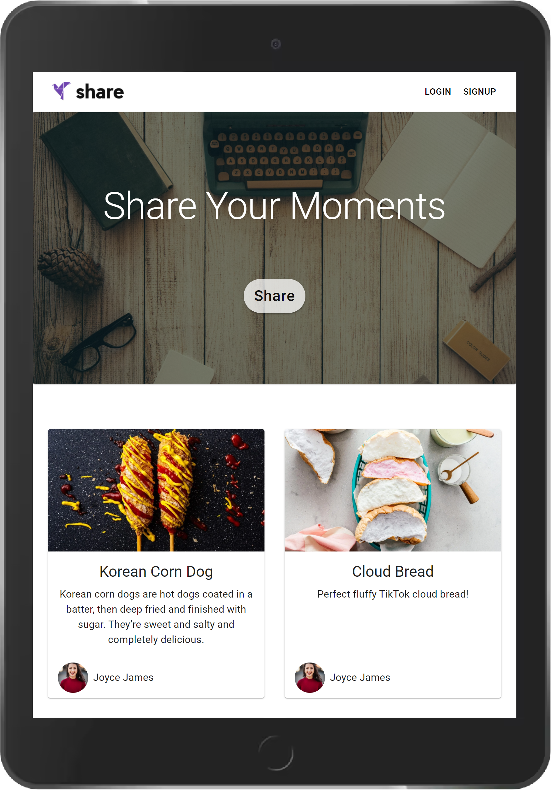

<h1 align="center"> Photo Blog   (MERN stack) </h1>

<i>A MERN stack photo blogging PWA(Progressive Web App), with user SignIn/SignUp, Google OAuth SignIn, user authentication & authorization feature.</i>

## Table of Contents

- [Live Demo](#live-demo)
- [Description](#description)
- [Tech Stack](#tech-stack)
- [Key Features](#key-features)
- [Project Setup](#project-setup)
- [Future Scope](#future-scope)

## Live Demo

<h2 align="center"><a  href="https://ll-mern-blog-app-client.netlify.app/">Live Demo Link</a></h2>

|                                                Mobile View                                                 |                                          Tablet View                                          |
| :--------------------------------------------------------------------------------------------------------: | :-------------------------------------------------------------------------------------------: |
|  |  |

## Description

A MERN stack photo blogging PWA(Progressive Web App), with user signIn/signUp, Google OAuth SignIn, user authentication & authorization feature.

Created full CRUD API to provides features of reading, creating, editing, and deleting posts.

Application used **React**, **Redux**, **React Router** and **Material UI** for the front-end, and **Node**, **Express** and **MongoDB** for the back-end.

The backend of the app is hosted on **Heroku**, frontend is hosted on **Netlify**.

<!-- =============================================== -->

## Tech Stack

#### Frontend:

- React.js,
- Redux, Redux Toolkit
- React Router
- Material UI,

#### Backend:

- Node.js
- Express.js
- JSON Web Tokens/JWT Auth
- Google OAuth 2.0
- Password Bcrypt
- Mongoose
- MongoDB Atlas

#### Development:

- GIT - for version control
- Bash - for CLI
- NPM - for package managing
<!-- =============================================== -->

## Key Features

- Read, create posts & edit/delete of your own posts
- Upload blog post images
- User Sign in & Sign up
- Sign in with Google using Google OAuth 2.0
- User avatar
- Responsive design

## Project Setup

1. Go to directory "server", and run "npm install".
2. In server directory, run "npm run start".
3. Go back to root directory.
4. Go to directory "client", and run "npm install".
5. In client directory, run "npm start".

## Future Scope

- Add login with google account
- Like post feature
- Post pagination
